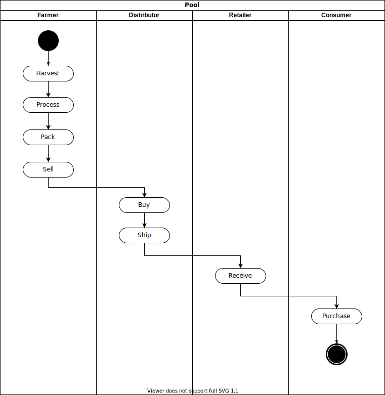
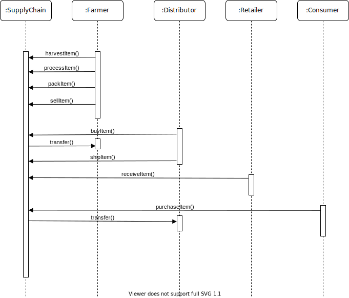
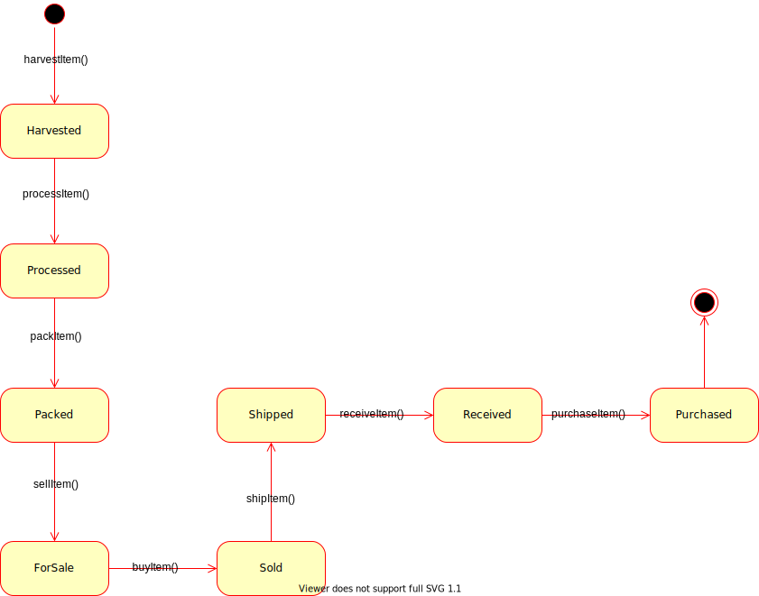
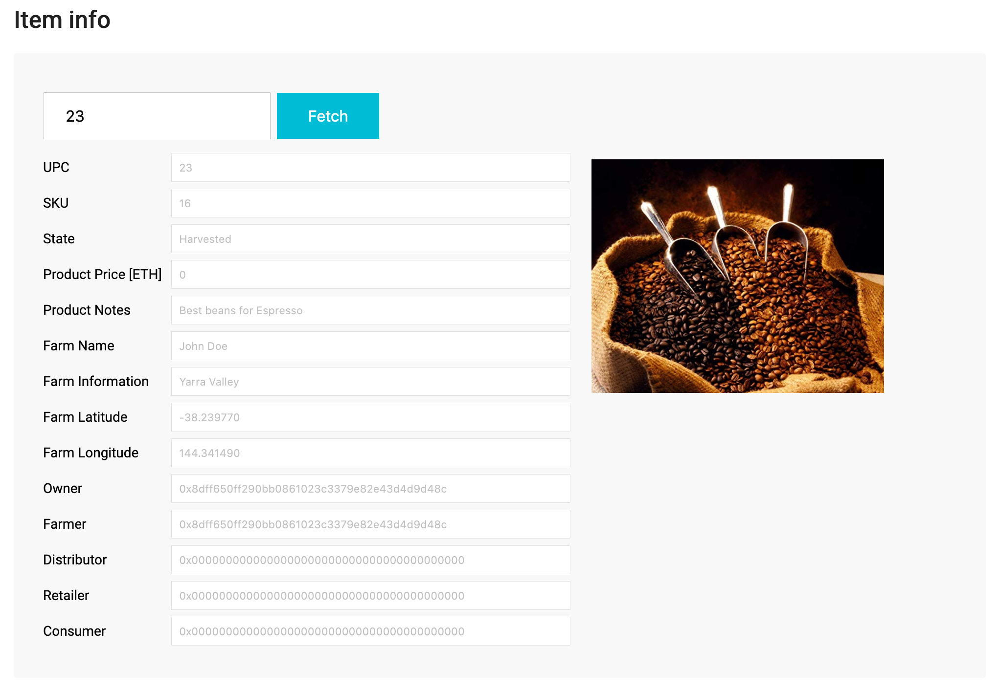

# Supply Chain - DApp

## Running the project

The easiest way to run a project is to run ganache-cli, deploy contracts using truffle and run the web app.

It is advised to use `npx` to avoid issues with node packages versions.

To run the project the following sequence could be used:
```shell script
npx ganache-cli 
npx truffle migrate
npm run dev
```

The browser has to have Metamask installed and be connected to the account from ganache.

Running tests:
```shell script
npm run contracts:test
```

Generating code coverage report (it will be available in `coverage` folder):
```shell script
npm run contracts:coverage
```

Running solhint:
```shell script
npm run contracts:lint
```

## Project Write-Up

### UML diagrams

#### Activity Diagram


#### Sequence Diagram


#### State Diagram


#### Class Diagram


## IPFS Usage

Project uses IPFS to store image the farmer uploads during Harvest operation. When user submits the data with the file,
web app connects to IPFS via Infura and adds the file to the network. Next, it stores the IPFS CID in the blockchain
(`Item` struct has additional attribute - `imageIPFSCid`). This attribute is queried using `fetchItemBufferOne` 
and used to get access to the file. Item info section displays the image if it has been uploaded during harvesting.
The following screen has the example of that feature:
 

## Libraries used

In the project following libraries were used:
* **truffle** _[5.1.12]_ - development environment and testing framework
* **bn.js** - math library with support for BigNumber in JavaScript
* **chai** - assertions library
* **chai-bn** - additional assertions library for BigNumbers
* **truffle-assertions** - additional assertions library to simplify checks for emitted events
* **solhint** - linter for Solidity contracts
* **solidity-coverage** - library for calculating test coverage for Solidity contracts
* **eth-gas-reporter** - library for calculating gas usage in Solidity contracts

## Deployment info

SupplyChain contract has been deployed to Rinkeby test network. Details of deployment:
* **transaction:** https://rinkeby.etherscan.io/tx/0xbc03e803b2e6a6990b5caeb47c44b24a15093623a4a9df988e2605479da8bc7a
* **contract address:** https://rinkeby.etherscan.io/address/0xa60db5e7f72f05b557c4420c0224a1e287d0014d
* item with UPC equal to `1` can be fetch to check see the data right away

## Additional comments
* `truffle` version has been updated to 5.x
* Solidity compiler has been updated to 0.5.x
* UI has been slightly redesigned and split into five sections
  * _Item info_ - enables to get item details for a specific UPC (from combined output of _fetchItemBufferOne_ and _fetchItemBufferTwo_)
  * _Farmer_ - section dedicated to user in farmer role
  * _Distributor_ - section dedicated to user in distributor role
  * _Retailer_ - section dedicated to user in retailer role
  * _Consumer_ - section dedicated to user in consumer role
  
  Each section dedicated to specific role has its own UPC context on which the operation will be invoked and Distributor and Consumer
  have additional input for setting the amount that they want to spent to buy/purchase item.


In development the following versions were used:
* node - 10.18.1
* npm - 6.13.7
* truffle - 5.1.12